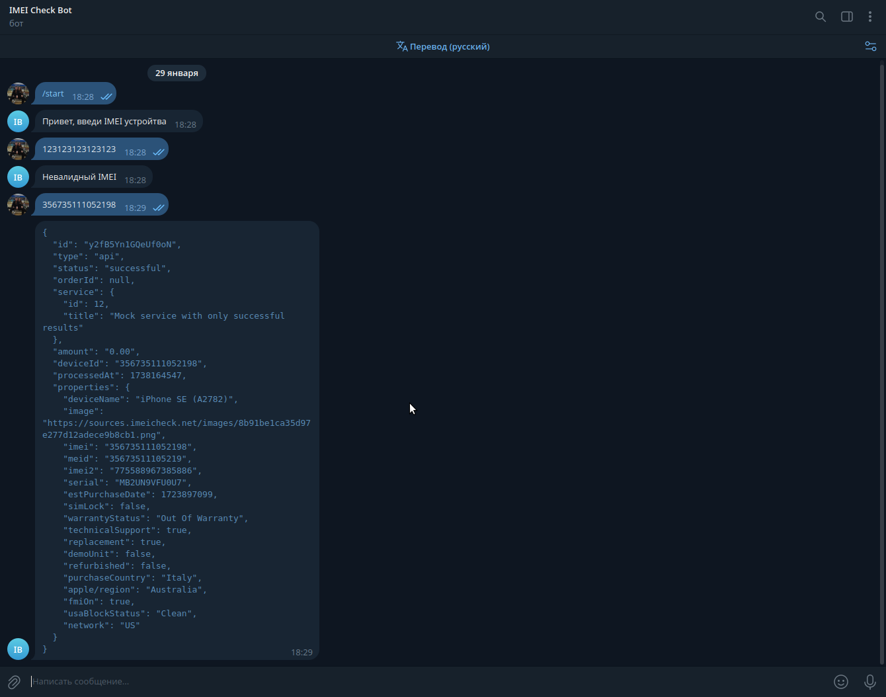

# IMEI Checker 

#### *Проект сделан в рамках Тестового задания.*

## Запуск

### Виртуальное окружение
```bash
python3 -m venv venv
```

```bash
source venv/bin/activate
```

```bash
pip install -r requirements.txt
```

### Переменные окружения(в корне создать файл .env):
`IMEI_API_TOKEN=token` - API ключ от стороннего сервиса
`BOT_TOKEN=token` - Токен бота
`ADMINS=12312313,123123123` - белый список админов для бота(через запятую TG id)
`BACKEND_DOMAIN=http://127.0.0.1:8000` - хост на котором запущено backend(если в докер, то `http://backend:8000`)


### Backend:
```bash
uvicorn app.backend.main:app --host 0.0.0.0 --port 8000 --reload
```


### Bot
``` bash
python app/bot/main.py
```

### Docker
```bash
docker compose up --build
```

#### API документация находится по адресу `http://127.0.0.1:8000/docs`
#### Тестовый IMEI - `356735111052198`


## Пример работы

<p align="center">
  
  
  
</p>


## Контакты

### Telegram - https://t.me/go_rshok
